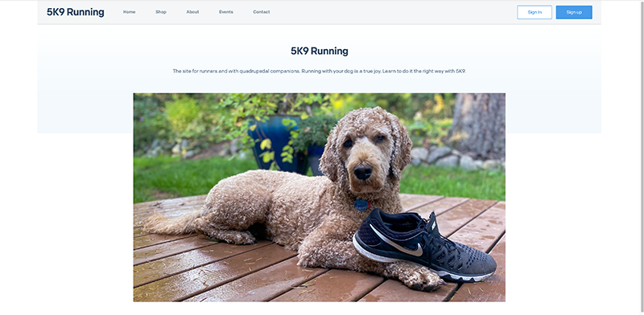

# SIGNAL Superclass 2021: Programmatic Email with Twilio SendGrid

## Contents

- [Session description](#session-description)
- [Documentation and resources](#documentation-and-resources)
- [Session outline](#session-outline)

## Session description

**This repository contains materials to accompany the [Twilio SendGrid session at SIGNAL Superclass 2021](https://signal.twilio.com/sessions/666952).**



Among the communication channels available today, email is non-negotiable. Email is reliable, works globally, and offers flexibility that can't be met by other communications avenues. That may be why 83% of customers prefer to receive business communications via email.

In this SIGNAL Superclass session, you'll learn how to implement the Twilio SendGrid Mail Send API to programmatically deliver email at scale. You'll also see how the Twilio SendGrid dynamic templating system makes it possible to personalize your messages for each customer, and you can expect some deliverability pro-tips along the way.

## Documentation and resources

The following documentation and resources will help you build upon what you learn in this session.

### SIGNAL 2021 email talks

- [SendGrid Sessions at SIGNAL 2021](https://signal.twilio.com/sessions?productFamily=Email)

### TwilioQuest

- [TwilioQuest](https://www.twilio.com/quest)

### Twilio SendGrid documentation and API reference

- [Twilio SendGrid documentation](https://docs.sendgrid.com/)
- [Twilio SendGrid API reference](https://docs.sendgrid.com/api-reference)

### Transactional vs Marketing email

- [Guide to transactional and marketing email](https://sendgrid.com/marketing/guide-transactional-and-marketing-email/)
- [Marketing vs transactional email](https://sendgrid.com/blog/marketing-email-vs-transactional-email-whats-difference/)

### Mail Send API quickstarts by language

- [Go](https://docs.sendgrid.com/for-developers/sending-email/quickstart-go)
- [Node.js](https://docs.sendgrid.com/for-developers/sending-email/quickstart-nodejs)
- [Python](https://docs.sendgrid.com/for-developers/sending-email/quickstart-python)
- [PHP](https://docs.sendgrid.com/for-developers/sending-email/quickstart-php)
- [Ruby](https://docs.sendgrid.com/for-developers/sending-email/quickstart-ruby)

### API keys and environment variables

- [API keys](https://docs.sendgrid.com/ui/account-and-settings/api-keys/)
- [API keys permission list](https://docs.sendgrid.com/api-reference/how-to-use-the-sendgrid-v3-api/authorization#api-key-permissions-list)

### Helper libraries

- [C#](https://github.com/sendgrid/sendgrid-csharp)
- [Go](https://github.com/sendgrid/sendgrid-go)
- [Java](https://github.com/sendgrid/sendgrid-java)
- [Node.js](https://github.com/sendgrid/sendgrid-nodejs)
- [PHP](https://github.com/sendgrid/sendgrid-php)
- [Python](https://github.com/sendgrid/sendgrid-python)
- [Ruby](https://github.com/sendgrid/sendgrid-ruby)

### Design and template documentation

- [How to send an email with Dynamic Transactional Templates](https://docs.sendgrid.com/ui/sending-email/how-to-send-an-email-with-dynamic-transactional-templates/)
- [The Design and Code Editor](https://docs.sendgrid.com/ui/sending-email/editor/)
- [Using Handlebars](https://docs.sendgrid.com/for-developers/sending-email/using-handlebars/)

### Send Verification documentation

- [Sender Identity explained](https://docs.sendgrid.com/for-developers/sending-email/sender-identity/)
- [How to set up domain authentication](https://docs.sendgrid.com/ui/account-and-settings/how-to-set-up-domain-authentication/)
- [How to verify a Single Sender](https://docs.sendgrid.com/ui/sending-email/sender-verification/)

### More information about Sender Identity and email authentication

- [Spoofing](https://twilio.com/docs/glossary/spoofing/)
- [SPF](https://twilio.com/docs/glossary/spf/)
- [DKIM](https://twilio.com/docs/glossary/dkim/)
- [Everything about DMARC](https://docs.sendgrid.com/ui/sending-email/dmarc)

## Session outline

This outline provides abbreviated steps and code snippets to help you follow along with the workshop. You can use this outline and the app in the [5K9](5K9) directory to replicate the workshop on your own.

### Prerequisites and setup

1. [Sign up for a SendGrid account](https://signup.sendgrid.com/).
2. [Create and store an API key](https://docs.sendgrid.com/ui/account-and-settings/api-keys/).
3. [Domain authentication](https://docs.sendgrid.com/ui/account-and-settings/how-to-set-up-domain-authentication#third-pane).
4. Navigate to the 5K9 directory of this repository.

```shell
cd 5K9
```

5. Install the project dependencies.

```shell
npm install
```

6. Start the application in developer mode.

```shell
npm run dev
```

### Modify the sendEmail file and add it to your route

- **File: `controllers/sendEmail.js`**

```javascript
module.exports = function sendEmail(toAddress, templateData) {
  const sgMail = require("@sendgrid/mail");
  sgMail.setApiKey(process.env.SENDGRID_API_KEY);

  const email = {
    to: toAddress,
    from: "from@example.com", // Change to your verified sending address
    templateId: "your-template-id", // Change to your template ID
    dynamicTemplateData: templateData,
  };

  sgMail
    .send(email)
    .then(() => {
      console.log("Email sent");
    })
    .catch((error) => {
      console.error(error);
    });
};
```

- **File: `routes/signup.js`**

```javascript
const express = require("express");
const router = express.Router();
const sendEmail = require("../controllers/sendEmail");

router.get("/", function (req, res, next) {
  res.render("signup");
});

router.post("/confirmation", function (req, res, next) {
  sendEmail(req.body.email, req.body);
  res.render("signup-confirmation");
});

module.exports = router;
```

### Template Handlebars snippets

- **template insert snippet**

```handlebars
{{ insert dog_name 'default=your super dog.'}}
```

- **template resources test data**

```json
{
    "first_name": "Miles",
    "dog_name": "Dash",
    "resources": {
        "loose_leash_guide": "Guide to Loose Leash Walking",
        "night_checklist": "Night Running Checklist",
        "harness_picks": "2021 Harness Picks"
    }
}
```

- **template resources list snippet**

```handlebars
<!-- Order Confirmation -->
<table class="module" role="module" data-type="text" border="0" cellpadding="0" width="100%" style="table-layout: fixed;">
    <!-- Divider -->
    <tr>
        <td colspan="2" style="padding: 10px 0px 10px 0px;">
            <table class="module" role="module" data-type="text" border="0" cellpadding="0" width="100%" style="table-layout: fixed;">
                <tr>
                    <td style="padding: 0px 0px 1px 0px; background-color: #333333;"></td>
                </tr>
            </table>
        </td>
    </tr>
    <!-- End Divider -->

    <!-- Reciept Header -->
    <tr>
        <td colspan="2" style="color: #1A82E2; text-align: left; padding: 15px 0px 15px 0px;">
            <h2 style="padding: 0px; margin: 0px;">Your training resources</h2>
        </td>
    </tr>


    <tr>
      <td valign="middle" style="color: #000000; text-align: left; padding: 0px 0px 5px 0px;">
        <ul>
          {{#each resources}}
            <li>{{this}}</li>
          {{/each}}
        </ul>
      </td>
    </tr>

    <!-- Divider -->
    <tr>
        <td colspan="2" style="padding: 10px 0px 10px 0px;">
            <table class="module" role="module" data-type="text" border="0" cellpadding="0" width="100%" style="table-layout: fixed;">
                <tr>
                    <td style="padding: 0px 0px 1px 0px; background-color: #333333;"></td>
                </tr>
            </table>
        </td>
    </tr>
    <!-- End Divider -->
</table>
```
